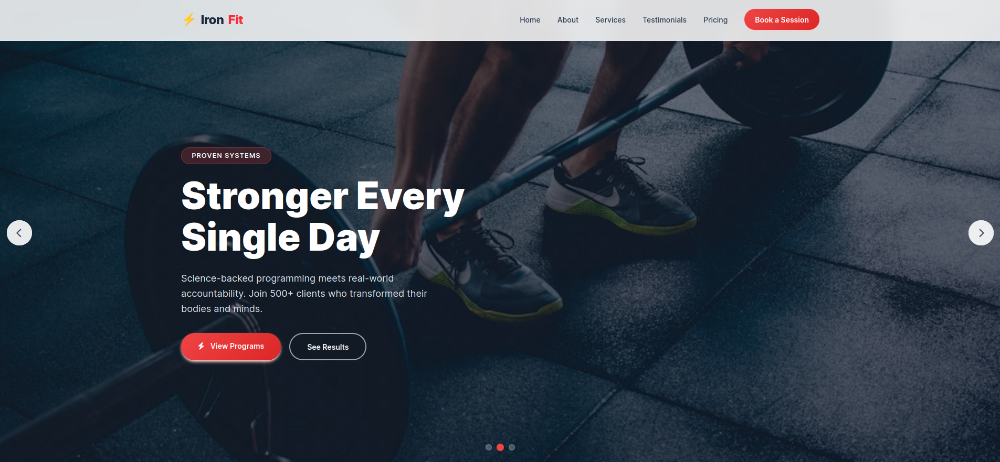
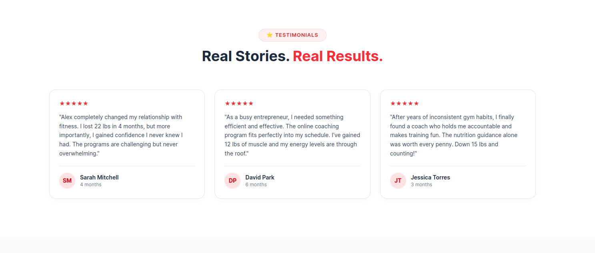
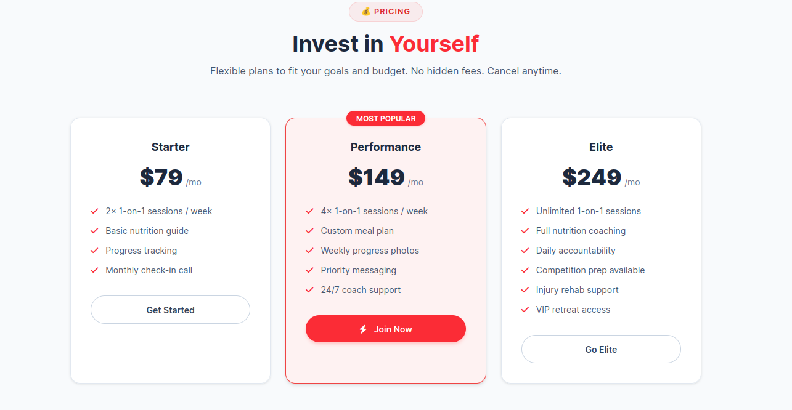
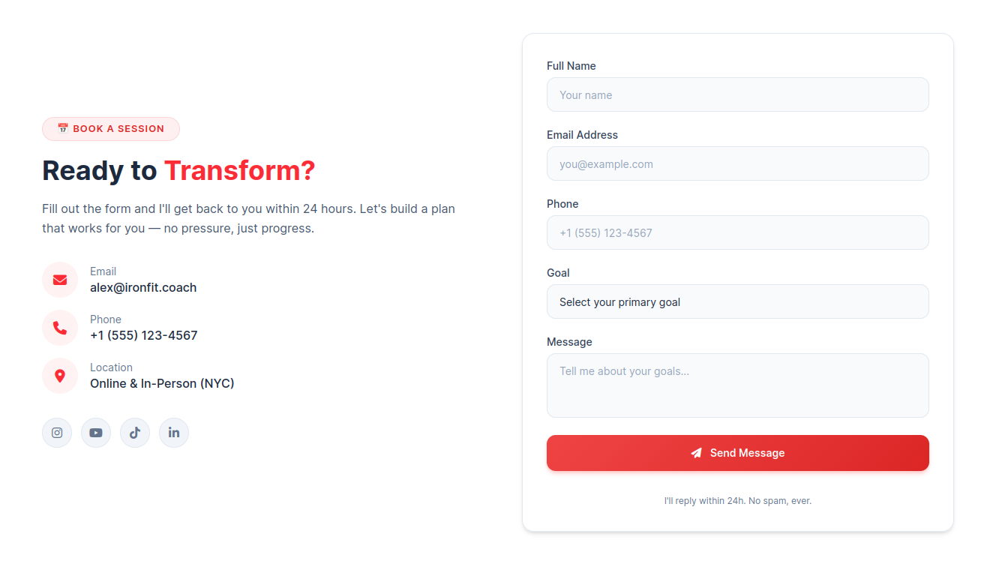

# IronFit Theme


A bold, modern personal trainer WordPress theme built for conversions. Features a dynamic hero slider, CPT-driven content sections, and a pre-built Tailwind CSS frontend.

**Author:** Shaik Obydullah

**Live Demo:** [obydullah.com/project/ironfit-wordpress-theme](https://obydullah.com/project/ironfit-wordpress-theme)


## Overview

IronFit is a single-page fitness theme designed for personal trainers, coaches, and gym owners. Content is managed through custom post types (CPTs) powered by the companion **IronFit Core** plugin, with site-wide settings stored in the plugin for portability across theme changes.

## Features

- **Dynamic Hero Slider** — Pulls from `ironfit_hero_slide` CPT with subtitle, description, and dual CTA buttons per slide
- **CPT-Driven Sections** — Services, Testimonials, and Pricing are rendered from custom post types, not hardcoded HTML
- **Booking Form** — AJAX-powered contact form that saves submissions as `ironfit_booking` CPT entries
- **Pre-built Tailwind CSS** — Compiled to a static CSS file (no CDN flash on page load)
- **Mobile Responsive** — Full mobile navigation, touch slider support, responsive grids
- **Fallback Hero** — Static hero section with stats, coach card, and rating when no slides exist

## Requirements

- WordPress 5.0+
- **IronFit Core** plugin (required — provides all CPTs, meta boxes, and settings)

## Installation

1. Upload the `ironfit-theme` folder to `wp-content/themes/`
2. Activate the theme from **Appearance → Themes**
3. Install and activate the **IronFit Core** plugin
4. Create hero slides under **IronFit Core → Hero Slides**
5. Add content to Services, Testimonials, and Pricing under their respective CPT menus
6. Configure contact info and about section under **IronFit Core → Site Settings**

## File Structure

```
ironfit-theme/
├── assets/
│   ├── css/
│   │   ├── admin-bar.css        # Admin bar spacing fix
│   │   ├── slider.css           # Hero slider + overlay styles
│   │   └── tailwind.css         # Compiled Tailwind CSS (minified)
│   └── js/
│       └── main.js              # Slider JS, mobile nav, booking AJAX
├── src/
│   └── input.css                # Tailwind source (custom components)
├── front-page.php               # Homepage template (all sections)
├── functions.php                # Enqueues, menus, widget area
├── header.php                   # Site header + navigation
├── footer.php                   # Site footer
├── style.css                    # Theme metadata + base styles
├── index.php                    # Blog post listing fallback
├── package.json                 # npm scripts for Tailwind build
├── README.md
└── documents/                   # Deployment artifacts (DB dump, media, config)
```

## Sections (front-page.php)

| Section           | Source                | CPT                   |
| ----------------- | --------------------- | --------------------- |
| Hero Slider       | Dynamic               | `ironfit_hero_slide`  |
| About             | Plugin options        | — (Site Settings)     |
| Services          | Dynamic               | `ironfit_service`     |
| Testimonials      | Dynamic               | `ironfit_testimonial` |
| Pricing           | Dynamic               | `ironfit_pricing`     |
| Contact / Booking | Plugin options + AJAX | `ironfit_booking`     |
| Blog (index.php)  | WP_Query loop         | `post` (standard)     |

## Development

### Rebuild Tailwind CSS

```bash
cd wp-content/themes/ironfit-theme
npm install
npm run build        # One-time build
npm run watch        # Watch mode for development
```

### Custom Styles

Custom component classes are defined in `src/input.css` under `@layer components`. After editing, run `npm run build` to regenerate `assets/css/tailwind.css`.

Key custom classes:

- `.btn-primary` — Red gradient button with hover scale
- `.btn-outline-light` — Outline button for dark backgrounds
- `.card-hover` — Lift + shadow on hover
- `.section-badge` — Red tinted pill badge for section headers
- `.testimonial-card` / `.pricing-card` — Card styles with borders
- `.nav-blur-light` — Frosted glass navbar
- `.input-field-light` — Form input styling with red focus ring

## Screenshots

### Hero Slider



### About Section


### Testimonials



### Pricing Plans



### Contact / Booking Form



## Browser Support

- Chrome, Firefox, Safari, Edge (latest versions)
- Mobile Safari, Chrome for Android
- Touch slider support for mobile devices

## License

GPL v2 or later
